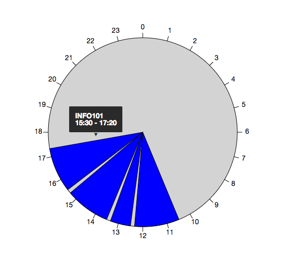

# a3-software-design

## PieScheduleChart
PieScheduleChart is a pie chart that represents the schedule of the day in 24 hour basis. Example shows typical schedule of informatics student



## General usage
This chart can visualize the daily schedule easily. There are scales outside of the circle indicates each time of the day and it encodes the input data with different size of the arcs based on start and end time of the schedule. This chart is expected to be used to organize and manage the time schedule. 
```javascript
{
    "INFO340" : {
        "startHour": 10,
        "startMinute": 30,
        "endHour":12,
        "endMinute":20
    },
    "INFO101" : {
        "startHour": 15,
        "startMinute": 30,
        "endHour":17,
        "endMinute":20
    },
    "Lunch" : {
        "startHour": 12,
        "startMinute": 30,
        "endHour":13,
        "endMinute":20
    },
    "INFO360" : {
        "startHour": 13,
        "startMinute": 30,
        "endHour":15,
        "endMinute":20
    }
}
```


## PieScheduleChart API

PieScheduleChart can be rendered with several parameters, including..
```javascript
    var psc = pieScheduleChart().radius(200)
                                .hover(true)
                                .fillColor('blue')

    var charts = d3.select('#my-div')
                        .datum(data)

    charts.enter().append("div")
        .attr('class', 'chart')
        .merge(charts)
        .call(psc);
```


## PieScheduleChart functions

All functions return the current PieScheduleChart object, otherwise returns notes to the user:

|functions      |Description|
|---------------|-----------|
|pieScheduleChart().width(num)|If there is no argument, it's set to 960. With the given input, it changes the width of pieScheduleChart. Number always has to be greater than 0. returns current PieScheduleChart.|
|pieScheduleChart().height(num)|If there is no argument, it's set to 800. With the given input, it changes the height of pieScheduleChart. Number always has to be greater than 0. returns current PieScheduleChart.|
|pieScheduleChart().radius(num)|If there is no argument, it's set to half of height. With the given input, it changes the radius of pieScheduleChart. Number always has to be greater than 0. returns current PieScheduleChart.|
|pieScheduleChart().colors(color)|If there is no argument, it's set to 'red' to fill the colors in the pie chart. input string has to be either one of keyword color or hex color.returns current PieScheduleChart
|pieScheduleChart().hover(bool)|If there is no argument, it's set to be 'true' so that it provides hovering function. When it's set to be false, it shows the current status when hovering to user. returns current PieScheduleChart|
|pieScheduleChart().lineColor(color)|If there is no argument, it's set to 'black' to fill the colors in the pie chart. input string has to be either one of keyword color or hex color.returns current PieScheduleChart

